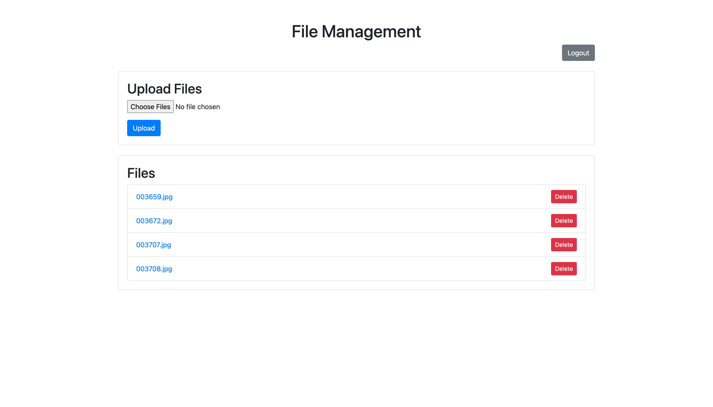

# Flask File Management Application

This is a simple file management web application built with Flask. It allows users to register, login, upload, download, and delete files. It also includes an upload progress bar for a better user experience.

## Features

- User Registration and Login
- File Upload (supports multiple files)
- File Download
- File Deletion

## Requirements

- Python 3.x
- Flask
- Flask-Login
- Flask-SQLAlchemy
- Bootstrap (via CDN)
- jQuery (via CDN)

## Installation

1. **Clone the repository:**

   ```bash
   git clone https://github.com/your-username/flask-file-management.git
   cd flask-file-management
   ```
2. **Create and activate a virtual environment:**

3. **Install the dependencies::**

4. **Set up the database:**
The database will be set up automatically when you run the application for the first time.

## Usage
1. **Run the application:**

   ```bash
   python app.py
   ```

2. **Open your web browser and go to:**
```bash
http://127.0.0.1:8000
```

3. **Register a new user and log in.**
Upload, download, and delete files.
4. **Upload, download, and delete files.**

## Directory Structure
```
file_management_app/
├── app.py
├── models.py
├── templates/
│   ├── index.html
│   ├── login.html
│   ├── register.html
├── static/
│   ├── js/
│       ├── scripts.js
├── uploads/
│   ├── (uploaded files will be stored here)
```
## Files

- `app.py`: The main Flask application file containing routes and application setup.
- `models.py`: Defines the User model for SQLAlchemy.
- `templates/`: Directory containing HTML templates for the application.
  - `index.html`: The main page template displaying file management features.
  - `login.html`: The login page template.
  - `register.html`: The registration page template.
- `static/js/scripts.js`: JavaScript file to handle file uploads with a progress bar.
- `uploads/`: Directory where uploaded files are stored.

## Screenshots

### Home Page



### Upload Progress


### Files List


## Contributing

1. Fork the repository.
2. Create your feature branch (`git checkout -b feature/fooBar`).
3. Commit your changes (`git commit -am 'Add some fooBar'`).
4. Push to the branch (`git push origin feature/fooBar`).
5. Create a new Pull Request.

## License

This project is licensed under the MIT License - see the [LICENSE](LICENSE) file for details.
